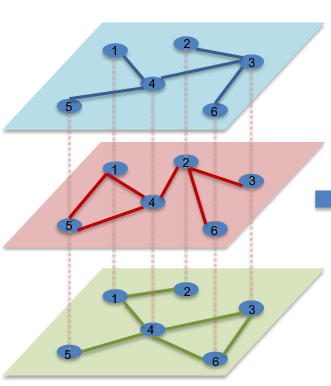

# **AIF Macronetworks**
______

# **Notebook: PT_macronetwork**

## Libraries used in the project
```py
import os
import openpyxl
import pandas as pd
import numpy as np
import networkx as nx
import matplotlib.pyplot as plt
from matplotlib.patches import Rectangle  
import matplotlib.colors as mcolors 
import matplotlib.colors as colors
import seaborn as sns
from random import randint
import itertools
from datetime import datetime
from matplotlib.backends.backend_pdf import PdfPages
warnings.filterwarnings('ignore')
```

## Table of Contents

- [Selecting and Configurating the requested data](#selecting-and-configurating-the-requested-data)
  * [Load Data Files from different paths and nature](#load-data-files-from-different-paths-and-nature)
    + [Read CSV File](#read-csv-file)
    + [Read Excel File](#read-excel-file)
- [Excel Data Loading and Processing](#excel-data-loading-and-processing)
  * [Load Excel File and Sheets](#load-excel-file-and-sheets)
  * [Filtering the chosen sheets values](#filtering-the-chosen-sheets-values)
     + [Filtering method used](#filtering-method-used)
- [Checking the inconsistencies and feature creation](#checking-the-inconsistencies-and-feature-creation)
  * [Processing the missing combinations](#processing-the-missing-combinations)
  * [Fill the missing values given the new combinations](#fill-the-missing-values-given-the-new-combinations)
  * [Disaggregating F51 to Create the New Instrument 512_519](#disaggregating-f51-to-create-the-new-instrument-512_519)
  * [Reordering the df grouping by setor and setor_cont](#reordering-the-df-grouping-by-setor-and-setor_cont) 
  * [Correcting the names and reordering](#correcting-the-names-and-reordering)
- [Create the directed Graph and the Adjacency Matrix](#create-the-directed-graph-and-the-adjacency-matrix)
- [Visualizations](#visualizations)
  * [Class generator HeatMap](#class-generator-heatmap)
     + [Heatmap Normalized](#heatmap-normalized)
     + [Heatmap Denormalized](#heatmap-denormalized)
   * [Chord Diagram](#chord-diagram)

_____

 
### Selecting and Configurating the Requested Data
#### Load Data Files from Different Paths and Nature
Given the different types of data we had to use the csv and the xlsx to read the data into the correct path. 
##### Read CSV File
As this is a CSV file there is no need to extract the data from different sheets so whatwe needed to do insted is to use the attribute sep= as the this is a Comma Separeted file and use encoding because some times it is not possible to read the file without it. If it is not working please change it to a different one such as UTF-8.
##### Read Excel File
Different from the CSV this type of file can have multiple sheets. Given the multiple sheets we procedeed to read all the sheets by its names
 
 
### Excel Data Loading and Processing
#### Filtering the Chosen Variables
The idea behing it would be to be able to adapt the data into the wishes of the individual. You could should choose from Fenomeno, Instrument, AP, Sector and Periodo (trimester)
##### Filtering Method Used
Using a simple excel file we are able to select and filter the information needed using a binary value. Zero to reject and one to pick into the new DataFrame
 
### Checking the Inconsistencies and Feature Creation
#### Processing the Missing Combinations
Using the combination between the selected variables we made sure that all the possible answers would be present in the data. Missing one combination would mean a missing value that would not be addressed. Even the values that had zero values are important as they also represent information. 
The expected combination between columns will always be as the formula:

unique fenomenos * unique setores * unique instrument* unique aps * unique sector_cont 

The unique DesignaInst were not included as this variable is dependent on the value of the Instrumento. In addition, the _NAME_ and _LABEL_ were also not considered as they only posses one value which is Valor

#### Fill the Missing Values Given the New Combinations
Once the missing combinations where found, we made sure that the right value and name where addressed in its form. We used the following strategy:
- _NAME_ and _LABEL_ were changed to Valor as you can see that is a constant in all the data 
- The missing value in DesignaInst were replaced follong the Instrumento information using a dictionary that would aggregate the most commum name for each Instrument and it respective DesignInst row by row
- The missing numeric values would always be transformed into a zero
#### Disaggregating F51 to Create the New Instrument 512_519
To enhance the dataset's structure, we needed to adjust the representation of one of the instruments, specifically the Instrument F51 ("Ações e outras participações exceto em fundos de investimento," Equity). This adjustment involved recalculating the values for the F51 instrument by identifying all relevant rows labeled as 'F51' and 'F511'. The code then subtracts the summed values of the 'F511' rows from the summed values of the 'F51' rows for each numeric column. The result of this subtraction is a new set of values representing a distinct category ('F512_519'), which is subsequently added back to the DataFrame. The formula is equal to: 'F51' = 'F511' + 'F512_519'

#### Reordering the df Grouping by Setor and Setor_cont 
In order to create the new column 'Total' the nodes were grouped by the custume order. From the same fenomeno, same setor, Instrumento, AP and then the Setor_Cont this whay we could see from a node what were the Instrumento connected by. Also made it easier to find specific nodes. In addition, we processed with the standart data checking for the shape and null values.

```py
# Small check to see if we missed anything
df.isnull().sum().sum()

# If there is any missing value in any part the entire row will appear here
null_lines = df[df.isnull().any(axis=1)]
null_lines
```

#### Creating the new rows for the totals and imputing values

Given the organized data, our objective is to calculate the total flow originating from specific combinations of fenomeno, sector, and AP. This process involves summing all the relationships connected to a specific node across all possible instruments. The DataFrame format facilitates this by allowing for the evaluation of data quality over different trimesters.

The provided function, 'add_total_rows', organizes the DataFrame by grouping data into chunks based on a specified size and summing numeric columns accordingly to create new "Total" rows.
```py
#Filling the missing data in the F rows (Total rows)

#Following the df order we have
df_with_totals['fenomeno'] = df_with_totals['fenomeno'].fillna(method='ffill') # This method propagate last valid observation forward to next valid 
df_with_totals['setor'] = df_with_totals['setor'].fillna(method='ffill')
df_with_totals['Instrumento'] = df_with_totals['Instrumento'].fillna('F')
df_with_totals['DesignaInst'] = df_with_totals['DesignaInst'].fillna('F')
df_with_totals['AP'] = df_with_totals['AP'].fillna(method='ffill')
df_with_totals['Setor_Cont'] = df_with_totals['Setor_Cont'].fillna(method='ffill')
df_with_totals['_NAME_'] = df_with_totals['_NAME_'].fillna('Valor')
df_with_totals['_LABEL_'] = df_with_totals['_LABEL_'].fillna('Valor') 

print('Number of missing values in df_with_total:', df_with_totals.isnull().sum().sum()) # guarantee that the are no missing values
df_with_totals
```
Note: Since this represents a directed network, the values from node X to node Y may not necessarily equal the values from node Y to node X.

#### Correcting the Names and Reordering
This part of the code replaces specific sector names with standardized international labels using a predefined dictionary (replacements) as seen under:
```py
   # Dictionary of replacements
   replacements = {
    'BC': 'CB',
    'OIFM': 'BNK',
    'FI': 'IFNM',
    'OIFAF_exc_FI': 'OFIeFI',
    'SS': 'INS',
    'FP': 'PF',
    'SNF': 'NFC',
    'AP': 'GOV',
    'Part': 'HH',
    'RM': 'RoW',
    'SF': 'FI',
    'IFM': 'MFI',
    'OIFAF': 'MFINM',
    'OIF': 'OFI',
    'AF': 'FA',
    'CATIVAS': 'CFIML',
    'SSFP': 'INSPF'
     }
 ```
    
Note that all the names and codes are listed as it will only change to if it were previously selected. This dictionary should store all the possible names and codes for being able to standardize the label without having to write them all over again.

Also the code is going to follow this order and if needed to change that here where you will need to replace:

```py
sector_order = ['CB', 'BNK', 'IFNM','OFI', 'FA', 'CFIML', 'OFIeFI', 'INS', 'PF', 'NFC', 'GOV', 'HH', 'RoW' ] 
```

### Create the Directed Graph and the Adjacency Matrix
Transforming a DataFrame into an adjacency matrix is crucial when you need to analyze relationships between entities, especially in network analysis. An adjacency matrix is a square matrix used to represent a finite graph. In this context:

Nodes and Connections: Nodes (represented on the matrix axes) symbolize entities like sectors, instruments, or phenomena. Connections between these nodes are represented by the values in the matrix cells.
Directionality and Weight: The adjacency matrix can represent directed relationships (e.g., flows or influences from one node to another) and their weights (e.g., the value of transactions, volume of data flow, or any measurable interaction).
Temporal Analysis: When working with temporal data (such as different trimesters), each intersection (matrix cell) for a specific period captures the strength or magnitude of the relationship during that timeframe.

How to Transform a DataFrame into an Adjacency Matrix
To transform a DataFrame into an adjacency matrix, follow these steps:

Identify Unique Nodes: Determine the unique entities (nodes) that will form the matrix's rows and columns. In your code, these nodes are the sectors (setor and Setor_Cont).

Define Relationships and Weights:
Relationships are defined by directed weighted edges between the nodes (e.g., transactions from one sector to another).
Weights represent the strength or value of these connections for each trimester. 

Note: there are some sectors that are expected to have no connection to other sectors for instance the familier that are not able to issue bonds and so on. 

Create a Directed Graph:
For each combination of fenomeno, AP, and instrumento, filter the DataFrame to capture relevant interactions for each trimester.
Use a library like NetworkX to create a directed graph (DiGraph) from this filtered data. The nodes are sectors, and the edges (with weights) represent the values from the DataFrame's numeric (trimester) columns.




Image souce: https://www.semanticscholar.org/paper/Multi-dimensional-Graph-Convolutional-Networks-Ma-Wang/a79ee3eeb567a1758a081b6965013bca0de5acfc

### Visualizations
To effectively interpret the processed data, we employ several visualizations that highlight relationships and patterns within the dataset. Each visualization is designed to provide a unique perspective, making it easier to understand the underlying connections between variables.

Another important note is that the charts were saved as pdf and also jpg both with dpi=600 to ensure the quality 

#### Class Generator HeatMap
The Class Generator Heatmap provide the code to produce a visualization of the relationships between different categories, providing insights into the strength and nature of connections.

##### Heatmap Normalized
The normalized heatmap presents the data in a way that adjusts for differences in magnitude across categories. By normalizing the values, we ensure that the visual representation focuses on the relative strength of connections rather than absolute values, making it easier to compare relationships across different sectors or phenomena. This visualization helps identify key patterns and trends by highlighting stronger relationships in darker shades and weaker ones in lighter shades.

The normalization was given by using the power that can be ajusted as needed. On the other hand we can also adjust the selected criterias of the instruments shown on the heatmap. 

Those are the changeable:

```py  
# fenomeno, AP, instrumento and period
CRITERIA_LIST = [                          # ONLY PLACE TO CHANGE to the information we want
    ('Pos', 'Ativo', 'F2M', '2023T3'),
    ('Pos', 'Ativo', 'F31', '2023T3'),
    ('Pos', 'Ativo', 'F32', '2023T3'),
    ('Pos', 'Ativo', 'F41', '2023T3'),
    ('Pos', 'Ativo', 'F42', '2023T3'),
    ('Pos', 'Ativo', 'F511', '2023T3'),
    ('Pos', 'Ativo', 'F52', '2023T3'),
    ('Pos', 'Ativo', 'F512_519', '2023T3'),
    ('Pos', 'Ativo', 'F', '2023T3')  
]
```
And also here:

```py           
# Create an instance of HeatmapGenerator and generate heatmaps
heatmap_generator = HeatmapGenerator(result_df, CRITERIA_LIST)
heatmap_generator.generate_heatmaps(power=10) # Change the power value if wanted
```

##### Heatmap Denormalized
The denormalized heatmap displays the raw values of connections between categories, offering a direct view of the absolute metrics. This version is useful for understanding the actual values involved in each connection, providing a clear picture of the data's magnitude. It is particularly valuable when the scale of values matters, such as in financial data or when assessing the total volume of interactions between entities.

#### Chord Diagram
The Chord Diagram offers a circular layout that illustrates the interconnections between different categories or nodes, such as sectors or instruments. This type of visualization is especially useful for displaying complex relationships in a visually appealing and intuitive format.

Nodes and Links: The Chord Diagram represents nodes (such as sectors) around a circle, with arcs connecting the nodes to show the relationships or flows between them. The thickness of each arc is proportional to the value of the interaction, providing a visual indication of the strength of the connection.

Directionality: This diagram can also depict the direction of the flow between nodes, which is essential for understanding the dynamics of interactions, such as which sector is contributing to another and to what extent. This directional flow is particularly useful in economic or network analyses where the source and destination of interactions are crucial.

Interactive Insights: By visualizing the entire dataset in a circular, interconnected format, the Chord Diagram enables users to quickly grasp complex relationships, identify clusters or groups, and observe how different entities interact within the network. This helps in uncovering hidden patterns and gaining deeper insights into the data's structure.


______

# **Notebook: Network Metrics**

## Table of Contents

- [Node Metrics](#node-metrics)
  * [Compute Node Centrality Metrics](#compute-node-centrality-metrics)
    + [In-Degree Centrality (IS)](#in-degree-centrality-is)
    + [Out-Degree Centrality (OS)](#out-degree-centrality-os)
    + [Degree Centrality (STR)](#degree-centrality-str)
    + [Betweenness Centrality](#betweenness-centrality)
    + [PageRank](#pagerank)
    + [Clustering Coefficient](#clustering-coefficient)
    + [Louvain Partition](#louvain-partition)
    + [Eigenvector Centrality](#eigenvector-centrality)
  * [Note on Weighted Calculations](#note-on-weighted-calculations)
  * [Use of Louvain Partition](#use-of-louvain-partition)
- [Creation of a Ranked DataFrame](#creation-of-a-ranked-dataframe)
- [Visualizations](#visualizations)
  * [Saving Directory](#saving-directory)
  * [Line Charts](#line-charts)
  * [Bump Charts](#bump-charts)
    + [Standard Bump Charts](#standard-bump-charts)
    + [Highlighted Bump Charts](#highlighted-bump-charts)
- [Network Metrics](#network-metrics)
  * [Line Chart Network Metrics](#line-chart-network-metrics)
    + [Density](#density)
    + [Assortativity](#assortativity)
  * [Cosine Similarity](#cosine-similarity)

## Libraries used in the project
```py
# import lybraries
import os
import community
import openpyxl
import pandas as pd
import numpy as np
import networkx as nx
import itertools
import matplotlib.pyplot as plt
import plotly.express as px
from networkx.algorithms import community
from datetime import datetime
import altair as alt
#from vega_datasets import data
import vl_convert as vlc  # Required for saving charts
from datetime import datetime
from scipy.sparse import csr_matrix
from sklearn.metrics.pairwise import cosine_similarity


import itertools
from collections import defaultdict, deque
from networkx.algorithms.community import modularity
from networkx.utils import py_random_state

import community as community_louvain
import matplotlib.cm as cm
import matplotlib.pyplot as plt
```

## Node Metrics

Considering all the preparation part of the code is already done in the previous notebook we now are going to proceed with the metrics.

This notebook computes various graph-based centrality metrics for nodes (sectors) in a directed network graph represented by an adjacency matrix. The metrics calculated include in-degree, out-degree, degree centrality, Betweenness centrality, PageRank, Clustering coefficient, Louvain partition, and Eigenvector centrality. The results are stored in a DataFrame for further analysis.

### Inputs
Given the inputs:

- **`instruments`**: A list of financial instruments for which metrics will be calculated.
- **`aps`**: A list of classification between Ativo and Passivo
- **`fenomenos`**: A list of classifiction between Pos and Trans
- **`dates`**: A list of dates corresponding to the time periods of interest.
- **`sectors`**: A list of sectors that represent the nodes in the network.
- **`adj_matrix`**: A pandas DataFrame containing the adjacency matrix with many submatrices inside it


### Compute Node Centrality Metrics

For easier manipulation and calculus the metrics were all gathered into metrics. 

```py
# Define weighted metrics using lambda functions
metrics = {
    # In-degree centrality: Sum of weights of incoming edges
    'IS': lambda G: {n: d for n, d in G.in_degree(weight='weight')},

    # Out-degree centrality: Sum of weights of outgoing edges
    'OS': lambda G: {n: d for n, d in G.out_degree(weight='weight')},

    # Degree centrality: Sum of weights of all edges (in + out)
    'STR': lambda G: {n: d for n, d in G.degree(weight='weight')},

    # Betweenness centrality: Considers shortest paths, with weights
    'Betweenness': lambda G: nx.betweenness_centrality(G, weight='weight'),

    # PageRank: Considers link weights for calculating node importance
    'PageRank': lambda G: nx.pagerank(G, weight='weight'),

    # Clustering coefficient: Considering weighted triangles for local clustering
    'Clustering': lambda G: nx.clustering(G, weight='weight'),
    
    # Louvain partition: Compute partitions using community_louvain. **
    'Louvrain': lambda G: community_louvain.best_partition(G.to_undirected(), weight='weight'),

    # Eigenvector centrality: Considers weighted adjacency for influence calculation
    'Eigencentrality': lambda G: nx.eigenvector_centrality_numpy(G, weight='weight')
}
```

Given the nature of the data it was necessary to use the weight once there were values higher than 1.

** The Louvain partition is only able to produce metrics for undirected graph, which is not the case. Thus, the directed graph was into a undirected one as the creator mentioned to have no intentions to adapt and develop a solution for being able to create a Louvrain metric using the directed graph until now. He recommend to transform into directed graph before producing the calculus.
Source: https://github.com/taynaud/python-louvain/issues/28

### Network Metrics Calculated

The following network metrics are computed for each sector within the graph representation of the adjacency matrix:

- **In-degree centrality (`'IS'`)**: The sum of the weights of incoming edges to a node.
- **Out-degree centrality (`'OS'`)**: The sum of the weights of outgoing edges from a node.
- **Degree centrality (`'STR'`)**: The sum of the weights of all edges (incoming and outgoing) for a node.
- **Betweenness centrality (`'Betweenness'`)**: Measures the extent to which a node lies on the shortest paths between other nodes, considering edge weights.
- **PageRank (`'PageRank'`)**: Determines the importance of a node based on the weighted links coming in and out.
- **Clustering coefficient (`'Clustering'`)**: Represents the likelihood that the neighbors of a node are also connected, considering weighted triangles.
- **Louvain partition (`'Louvrain'`)**: Detects communities within the network using the Louvain method for community detection, optimized for modularity.
- **Eigenvector centrality (`'Eigencentrality'`)**: Measures the influence of a node in a network, taking into account both direct and indirect connections.

### Code Explanation

#### Multi index Adjacency Matrix sliding and interation of the combinations
Once the DataFrame was a multi index adjacency matrix with many submatrices inside it. The code made sure to interate over each combination of the instruments and dates possibles, guaranteing that the sub-matrix were in the same format independently of the number of variables chosen by now. We can see this by using:

```py 
# Ensure the sub-matrix is square and valid if not break
        if sub_matrix.shape[0] != len(sectors) or sub_matrix.shape[1] != len(sectors):
            break
```
If there were any difference the code would break and the code would not run.

#### Directed Graph 
Once sliced and the matrix made into a array the code will then map the nodes and lable to sector names making sure it understands which sub matrix correspond to each. 

```py
        # Create a directed graph from the adjacency matrix using from_numpy_array
        G = nx.from_numpy_array(sub_matrix, create_using=nx.DiGraph())
        
        # Map node labels to sector names
        mapping = {i: sectors[i] for i in range(len(sectors))}
        G = nx.relabel_nodes(G, mapping)

        # Calculate metrics for each sector
        for sector in sectors:
            # Prepare the metrics data for the sector
            sector_metrics = {
                'Instrument': instrument, 
                'Date': date,        
                'Sector': sector,    
            }
            
            # Calculate and store metrics
            for metric_name, metric_func in metrics.items():
                sector_metrics[metric_name] = metric_func(G).get(sector, 0)
            
            # Add the sector metrics to the list
            metrics_data_list.append(sector_metrics)
```

The new DataFrame should have each one the combinations of Intruments, Date and Sector making sure all the possible 

### Creation of a ranked df
This addition to the DataFrame will facilitate the development of charts later on. The code groups data by fenomeno, ap, instrument, and date to identify the highest value across different sectors and rank the numeric values accordingly. A new column is created for each metric that can be ranked. The Clustering and Louvain metrics are not ranked within the DataFrame. For easier processing, these ranks were initially included but were removed from the DataFrame afterward.

#### Ranked DataFrame 
The ranked DataFrame was created to store all metric values and provide information for subsequent visualizations. The Excel file is named PT_node_metrics.

## Visualizations
All the visualizations charts are going to be stored in a base directory called figures and inside it the name of the chart metrics. According to self preference the graph is going to be named according to what were selected. If needed to have the title inside the graph please take the # of the tittle code.

The sectors colors were defined as following:
```py
Define the colors for each sector
Red, Green, Blue (RGB) values are normalized by dividing by 255

sector_colors = {
    'CB': (0/255, 70/255, 122/255),     # Dark Blue (Central Bank)
    'BNK': (155/255, 125/255, 64/255),  # Light Brown (Banks)
    'IFNM': (242/255, 200/255, 81/255), # Pale Yellow (Investment Funds and Non-Monetary Financial Institutions)
    'INS': (50/255, 70/255, 237/255),   # Bright Blue (Insurance Companies)
    'PF': (237/255, 26/255, 59/255),    # Red (Pension Funds)
    'NFC': (50/255, 104/255, 49/255),   # Dark Green (Non-Financial Corporations)
    'GOV': (245/255, 130/255, 50/255),  # Orange (Government)
    'HH': (137/255, 137/255, 137/255),  # Gray (Households)
    'RoW': (0/255, 0/255, 0/255),       # Black (Rest of the World)
    'OFI': (248/255, 164/255, 177/255), # Light Pink (Other Financial Institutions)
    'FA': (147/255, 78/255, 30/255),    # Brown (Financial Auxiliaries)
    'CFIML': (50/255, 170/255, 79/255)  # Medium Green (Collective Investment Funds and Money Market Funds)
}
```
### Saving directory

Inside each chart building functiction you can notice the same strategy to save the graphs built.

First we would create or direct the place where it would be saved as well as how the file would be named. In this exemple the file named would be 'NAME'.

```py
# Define the base directory and create it if it doesn't exist
base_directory = '../figures/NAME'   # Change the name of the file if needed here
if not os.path.exists(base_directory):
        os.makedirs(base_directory)
```

Secontly we would need to save with the respective names the actuall graph. Important to note that we wont have to name all the files names but we will reference to what it should be getting the variables from. In this case it is {instrument} and {rank_column}.

```py
# Define the full file path
filename_base = f'NAME_{instrument}_{rank_column}'
file_path_pdf = os.path.join(base_directory, f'{filename_base}.pdf')
file_path_png = os.path.join(base_directory, f'{filename_base}.png')
```

Final step is to save the graphs.

```py
# Save the plot as PDF and JPG inside the Linechart_Node_Metrics directory
plt.savefig(file_path_pdf, format='pdf', dpi=600)
plt.savefig(file_path_jpg, format='jpg', dpi=600)
```

### Line Charts 
Also using a function the code will generate all the possible line charts for each metrics and instruemnts per year.

```py
# List of all metrics you want to plot
metrics_list = ['IS', 'OS', 'STR', 'Betweenness', 'PageRank', 'Eigencentrality']

# List of all instruments you want to plot (you can define this list or extract unique values from your DataFrame)
instruments_list = ranked_df['Instrument'].unique()

# Loop over each instrument and each metric
for instrument in instruments_list:
    for metric in metrics_list:
        plot_sectors_by_date(ranked_df, instrument, metric)
```

### Bump Charts 

The idea of the Bump Chart is to indicate by a rank how is a specific Instrument is going over time. 

When developing the ranking DataFrame it came to my eye that there was not possible to make ranks of specific metrics such as Clustering and Louvrain. The other problem was that when ranking some values would be equal so that the solution made so there would be more than on value in the same possition would be to order by the Sectors order. This decision was made before on the rank df but here is were we will see the difference. 

#### Bump Charts

The code started as usual: filtering the relevant dates so the T4 and getting the last five years to be plotted. 

The code is built to get the last five years. As it writes the [-5:], someone could change it to the last i years by changing the code as: [-i:]

```py
# Filter for the last 5 years
last_five_years = sorted(filtered_df['Year'].unique())[-5:]
filtered_df = filtered_df[filtered_df['Year'].isin(last_five_years)]
```

#### Highlighted Bump Chart
Same code as above but the colours of the non relevant ones are now in grey. The way it works is by changing the colours of the less important ones to gray 


## Network Metrics
Once the adjacency matrix is prepared, this section of the code calculates density and assortativity metrics for each network. These metrics are then stored in a DataFrame for later analysis. The code iterates through combinations of Fenomeno, AP, Instrument, and Date, creating sub-matrices from the adjacency matrix and performing network analysis on each sub-matrix.

A list is initialized to store the results of the calculations for each network as dictionaries.
```py
# Initialize a list to store the results as dictionaries
metrics_data_list = []
```

The code uses nested loops to iterate over all possible combinations of Fenomeno, AP, Instrument, and Date. For each combination, a sub-matrix is extracted from the multi-indexed adj_matrix.

```py
for fenomeno in fenomenos:
    for ap in aps:
        for instrument in instruments:
            for date in dates:
                # Process each combination

```
 
For each combination of Fenomeno, AP, and Instrument, the corresponding sub-matrix is extracted from the adj_matrix. This sub-matrix represents the connections between different sectors on a specific date.

```py
sub_matrix = adj_matrix.xs((fenomeno, ap, instrument), 
                           level=['Fenomeno', 'AP', 'Instrument'], 
                           axis=0).loc[:, (date, sectors)].values

```

Since for each combination of Fenomeno, AP, and Instrument, we always have the same total number of sectors and dates, the code ensures that the extracted sub-matrix is valid by checking that it is square.

```py
if sub_matrix.shape[0] != len(sectors) or sub_matrix.shape[1] != len(sectors):
    continue  # Skip if matrix is not valid
```
Using the extracted sub-matrix, a directed graph is created using NetworkX. The graph nodes represent sectors, and the matrix values represent directed edges between them.


```py
A = nx.from_numpy_array(sub_matrix, create_using=nx.DiGraph())
```

The nodes are then relabeled to match the sector names instead of their integer indices:

```py
mapping = {i: sectors[i] for i in range(len(sectors))}
A = nx.relabel_nodes(A, mapping)```


For each graph, the following metrics are calculated:

```py
density = nx.density(A)

assortativity_OI = nx.degree_assortativity_coefficient(A, x='out', y='in', weight='weight')
assortativity_IO = nx.degree_assortativity_coefficient(A, x='in', y='out', weight='weight')
assortativity_OO = nx.degree_assortativity_coefficient(A, x='out', y='out', weight='weight')
assortativity_II = nx.degree_assortativity_coefficient(A, x='in', y='in', weight='weight')

```

After all combinations have been processed, the list of dictionaries is converted into a pandas DataFrame for easy analysis and visualization of the calculated network metrics.

```py
network_df = pd.DataFrame(metrics_data_list)
```
This DataFrame can now be used to examine the network properties, such as how sector relationships evolve over time or differ by Fenomeno, AP, or Instrument.

### Line Chart Network Metrics 

This function plots line charts for various network metrics calculated above over a specified range of trimesters for all instruments available in the dataset.

Once the new column with the date information manipulated. The function was created: plot_trimester_line_charts_for_all_instruments() generates and saves line charts that visualize how the density and assortativity metrics change over time for each instrument. The function allows users to specify a range of trimesters and saves the plots as both PDF and JPG files in a designated folder.

Aiming to ease the process for the code it was developed a trimester to date mecanism:

```py
def trimester_to_date(trimester):
    # Convert trimester to a specific date (last day of the trimester)
    year = int(trimester[:4])
    tri = int(trimester[-1])
    if tri == 1:
        return datetime(year, 3, 31)
    elif tri == 2:
        return datetime(year, 6, 30)
    elif tri == 3:
        return datetime(year, 9, 30)
    elif tri == 4:
        return datetime(year, 12, 31)

```
A date range is generated between the start and end trimesters using pd.date_range() and adjusted to match the trimester periods. This ensures that the x-axis labels are aligned with the trimesters.

```py
date_range = pd.date_range(start=start_date, end=end_date, freq='3M').to_pydatetime().tolist()
tick_labels = [f'{d.year}T{((d.month - 1) // 3) + 1}' for d in date_range]
```

To use this function, pass your network_df DataFrame and specify the trimester range. For example:


```py
plot_trimester_line_charts_for_all_instruments(network_df, '2017T1', '2024T4')
```

This will generate line charts for all instruments in the DataFrame between the first trimester of 2017 and the fourth trimester of 2024, saving them in the specified directory.


### Cosine Similarity 

Cosine Similarity
To calculate cosine similarity, we followed these steps:

1) Summed the values of each sub-matrix for every combination and stored them in a dictionary for easy access.
2) Used the dictionary to retrieve the percentage values for each sub-matrix.
3) Calculated the cosine similarity based on these values.

